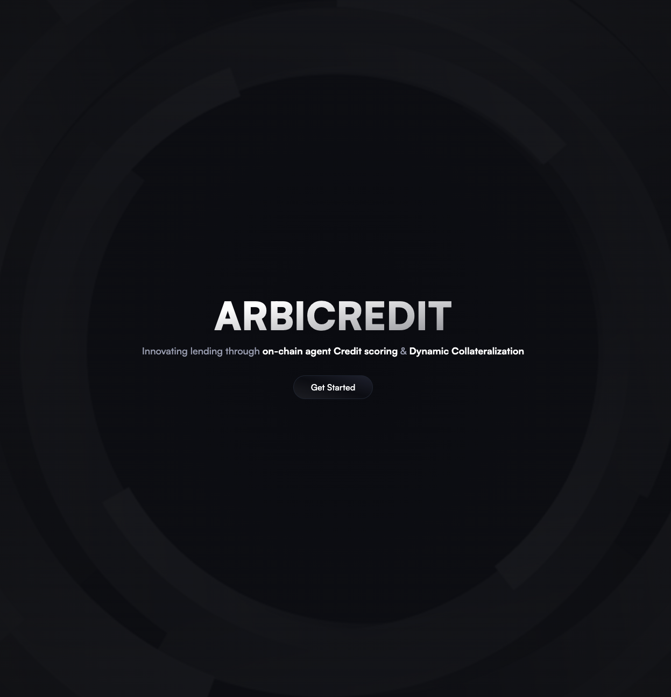
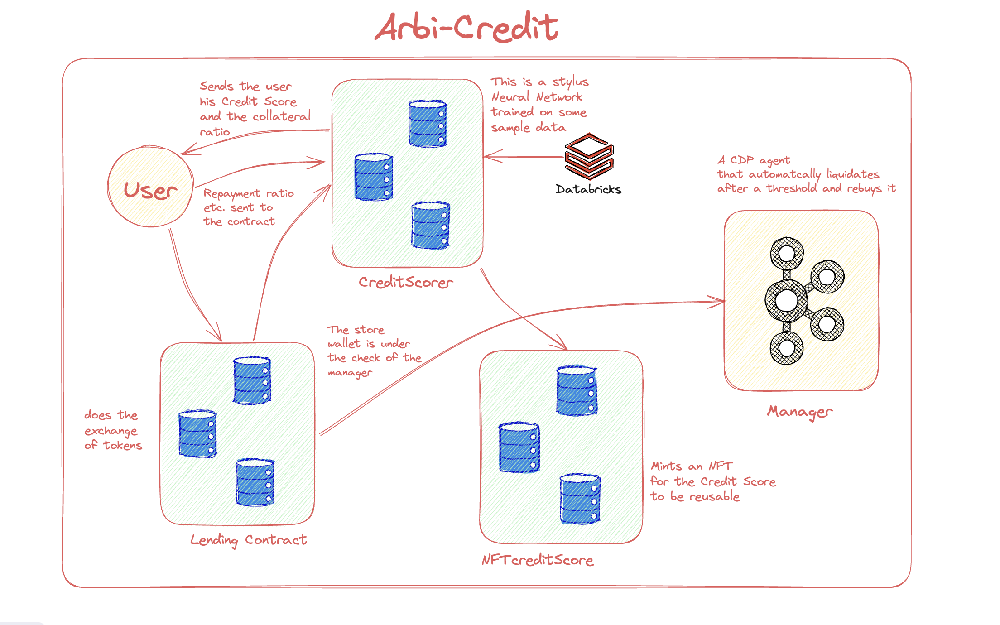
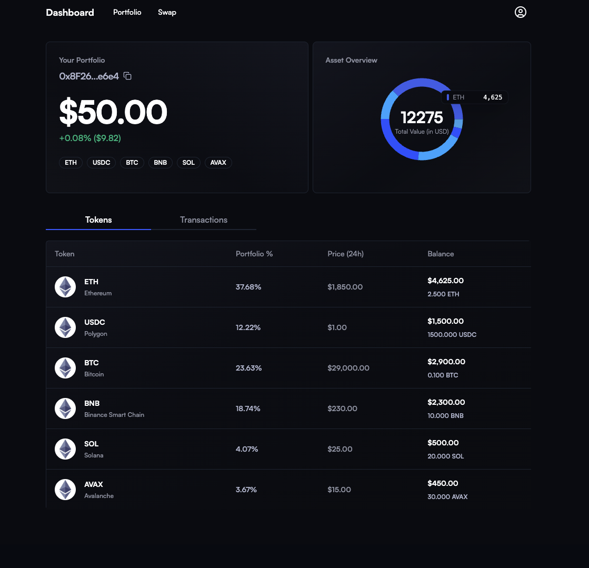

# ArbiCredit 


<center></center>

<center>Our platform redefines digital lending by integrating an on-chain AI agent built using Arbitrum Stylus, which generates dynamic credit scores and allocates collateral based on real-time data. Each user receives an NFT encapsulating their credit profile and collateral details, ensuring transparency and trust throughout the lending process. Additionally, by leveraging Coinbase's Agent Kit, our system proactively manages token movements during sudden market shifts to protect against volatility.


## Overview



Our platform automates lending by integrating:
- **Instant Credit Assessment:** On-chain AI <b>Neural Network</b> generates a real-time credit scores.
- **NFT-Backed Digital Identity:** Immutable NFTs capture each user's credit and collateral data.
- **Dynamic Collateral Management:** Automated adjustments based on market conditions.
- **Automated Risk Mitigation:** Real-time monitoring and liquidation to safeguard assets.
- **DefAI Integration:** Agent Kit ensures swift token management during market volatility.

## sFeatures

- **Instant Credit Scoring:**  
  The on-chain Neural Network based AI agent processes real-time data to generate a unique credit score for each user, eliminating delays associated with traditional credit checks.

- **NFT-Backed Trust:**  
  Minted NFTs represent a user's credit and collateral profile, creating a secure, immutable record that enhances transparency.

- **Dynamic Collateral Allocation:**  
  Collateral requirements are adjusted automatically based on real-time market data to protect both lenders and borrowers.

- **Automated Risk Management:**  
  Our integrated CDP agent kit continuously monitors token prices. In the event of a significant price drop, it automatically liquidates a portion of the collateral to manage risk.

## Architecture



``` 
Stylus Contract Addresses on Sepolia

CreditScorer : 0xB53E69dCF35E0b9789B5a9e64685244b1Ccced33  
NFTCredit : 0x3b192B43bB38C9a48be7110ef5763AebA405B150
```

### User
- **Description**: The user interacts with the Arbi-Credit platform by providing relevant financial data (repayment history, liquidation events, loan amounts).
- **Key Responsibilities**:
  - Initiates the credit-scoring process.
  - Supplies collateral as required.
  - Receives the NFT credit score token.

### CreditScorer
- **Description**: A stylus neural network terminal or an on-chain agent that aggregates and analyzes user data to determine a credit score.
- **Key Responsibilities**:
  - Uses user’s repayment ratio, liquidation history, and total loan data to calculate a score.
  - Writes the credit score to the chain.

### Lending Contract
- **Description**: A smart contract that handles the lending and borrowing operations, enforcing collateral requirements.
- **Key Responsibilities**:
  - Receives the user’s collateral.
  - Executes the loan process based on the assigned credit score.
  - Interacts with the user’s wallet and manages funds.

### NFTCreditScore
- **Description**: A contract that mints an NFT containing the user’s credit score data.
- **Key Responsibilities**:
  - Generates an NFT for each user once their credit score is finalized.
  - Stores relevant score metadata (repayment ratio, loan details, etc.) on-chain or via decentralized storage.

### Manager (Agent Kit)
- **Description**: A decentralized agent or bot that monitors collateral health and triggers liquidations when necessary.
- **Key Responsibilities**:
  - Continuously checks the price of deposited tokens.
  - Initiates liquidation if collateral value falls below the threshold.
  - Maintains stable operations by enforcing risk management rules.

### Data Flow



1. **User Data Submission**  
   - The user provides on-chain history or allows the CreditScorer to query their repayment ratio, total liquidations, and total loans.

2. **Credit Score Computation**  
   - The CreditScorer (neural network/agent) processes the user data and calculates a numerical credit score.

3. **Collateral Assignment**  
   - Based on the credit score, the system determines how much collateral the user must deposit to secure a loan.

4. **Lending & Borrowing**  
   - The user deposits collateral into the Lending Contract.
   - The Lending Contract enables the user to borrow tokens or assets up to a limit set by their credit score.

5. **NFT Minting**  
   - Once the credit score is finalized, the NFTCreditScore contract mints an NFT representing the user’s credit score.
   - This NFT can be stored in the user’s wallet and used to prove their creditworthiness.

6. **Collateral Monitoring & Liquidation**  
   - The Manager (Agent Kit) keeps track of the collateral’s value in real time.
   - If the collateral value drops below the required ratio, the Manag


## Challenges Encountered

- **Computational Overhead On-Chain:**  
  Running neural networks on-chain presented significant computational challenges. We had to optimize our AI models to ensure efficient execution within blockchain constraints without sacrificing predictive accuracy.

- **Scarcity of Test Data for Training:**  
  The decentralized nature of the platform limited access to traditional test data. To overcome this, we synthesized data and simulated various scenarios to train our AI models effectively.

- **Managing Liquidity Amid Price Fluctuations:**  
  Continuous monitoring of token prices is critical. Our system had to be robust enough to handle rapid market changes and execute timely liquidations, ensuring liquidity and stability for both borrowers and lenders.


## Future 

- **Merkle tree:**
  Trying to implement a merkle tree storage for the User's data which would make it private as well as would 
  be more efficient time complexity wise 

- **Twitter:** 
  Using Agent kit's twitter functionality to check the meta-data of the twitter account of the user , which would help in checking the User's idendity and also in generating the Credit Score . 

- **Dynamic on-chain collateralizer:**
  An on-chain Agent which excess the price feed data and Credit score of the user to give the Collateral based on the real time 